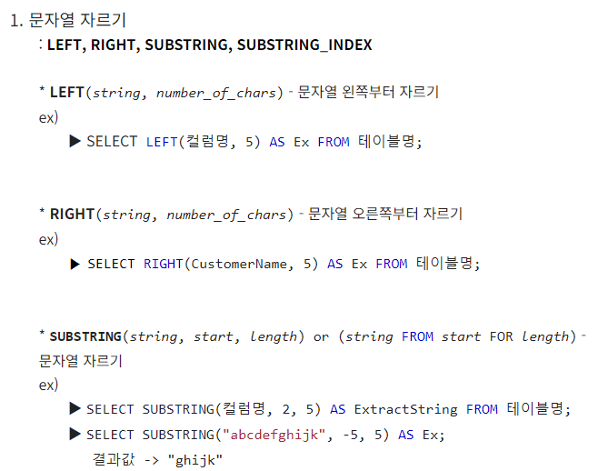
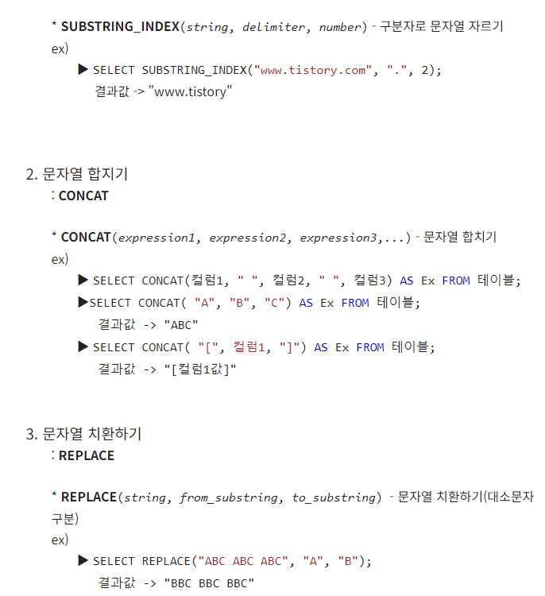
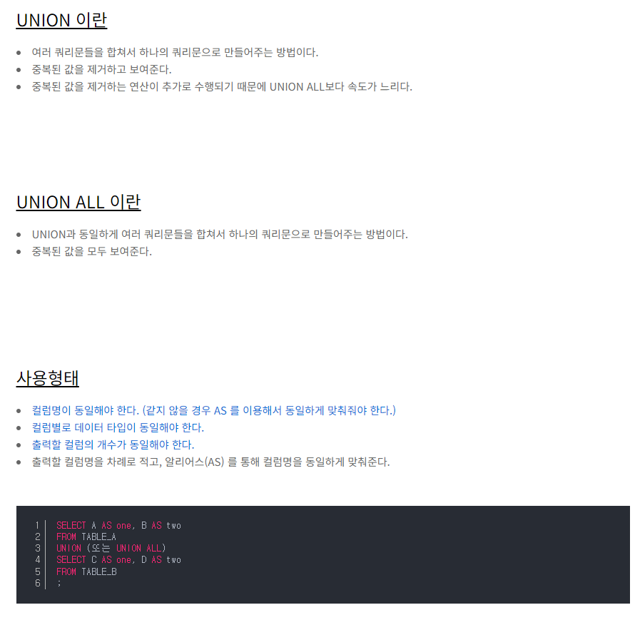

https://school.programmers.co.kr/learn/courses/30/lessons/131537
Q. join하고 on이 없어도돼?

A.
`JOIN`을 사용할 때 `ON` 절 없이 쿼리를 작성하는 것은 일반적으로 권장되지 않습니다. `ON` 절은 두 테이블을 어떤 기준으로 결합할지 명시하는 중요한 부분입니다. 그러나 특정 상황에서 `ON` 절 없이 `JOIN`을 사용할 수 있는 경우가 있습니다:

1. **CROSS JOIN**: `ON` 절 없이 `JOIN`을 사용하면, SQL에서는 이를 `CROSS JOIN`으로 해석합니다. `CROSS JOIN`은 두 테이블 간의 모든 가능한 조합을 생성합니다. 예를 들어, 한 테이블에 5행이 있고 다른 테이블에 3행이 있다면, 결과는 15행(5 * 3)이 됩니다. 이는 대부분의 비즈니스 요구 사항에는 적합하지 않으며, 데이터 양이 많을 경우 성능 문제를 일으킬 수 있습니다.

2. **NATURAL JOIN**: `NATURAL JOIN`은 `ON` 절 없이도 사용할 수 있으며, 두 테이블 간에 같은 이름을 가진 모든 컬럼을 기준으로 자동으로 조인합니다. 하지만 이 방식은 명시적이지 않고, 데이터베이스 스키마가 변경될 경우 예기치 않은 결과를 초래할 수 있어 권장되지 않습니다.

3. **USING 절**: `JOIN`에서 `ON` 대신 `USING`을 사용할 수도 있습니다. 이는 두 테이블이 조인될 때 사용될 컬럼 이름이 같을 경우에 유용합니다. `USING` 절은 `ON` 절보다는 더 간결하지만, 여전히 어떤 기준으로 조인할지 명시하는 역할을 합니다.

결론적으로, `ON` 절 없이 `JOIN`을 사용하는 것은 특정 유형의 조인(`CROSS JOIN`이나 `NATURAL JOIN`)에 한정되며, 대부분의 경우에는 조인할 테이블 간의 관계를 명확히 정의하기 위해 `ON` 절이나 `USING` 절을 사용하는 것이 좋습니다. 명시적으로 조인 조건을 지정함으로써, 더 명확하고 예측 가능한 쿼리 결과를 얻을 수 있습니다.


조인에 특정 조인 조건이 명시되어 있지 않으면, 이는 크로스 조인(cross join)으로 간주된다!!!
=> A table과 B table의 모든 조합을 만들어냄

***
https://school.programmers.co.kr/learn/courses/30/lessons/131123
Q. GROUP BY는 가장 먼저 나오는 거를 하나 뽑음?

GROUP BY 절을 사용하는 경우, SQL은 지정된 컬럼(들)의 값이 같은 행들을 그룹화합니다. 그러나 GROUP BY가 "가장 먼저 나오는 걸 하나 뽑는다"는 표현은 정확하지 않습니다. GROUP BY는 단순히 데이터를 그룹화하며, 그룹 내에서 어떤 행을 선택할지 결정하지 않습니다. 대신, GROUP BY와 함께 사용되는 집계 함수(예: COUNT(), SUM(), AVG(), MAX(), MIN() 등)는 그룹별로 계산된 결과를 반환합니다.

Q. 집계 함수안쓰면 어떤게 뽑히는데

SQL에서 GROUP BY 절을 사용하되 집계 함수를 사용하지 않는 경우, 쿼리의 결과는 SQL 표준이나 데이터베이스 관리 시스템(DBMS)의 구현에 따라 달라질 수 있습니다. 대부분의 현대적인 DBMS에서는 GROUP BY 절이 있는데 집계 함수가 없는 경우 오류를 반환합니다. 그 이유는 GROUP BY로 그룹화된 후에, 각 그룹에 대해 단일 행만 반환해야 하는데, 집계 함수 없이 어떤 값을 선택해야 할지 명확하지 않기 때문입니다.

예를 들어, 다음과 같은 쿼리를 고려해보겠습니다:

```
sql
Copy code
SELECT column1, column2
FROM table
GROUP BY column1;
```

이 쿼리에서 column1을 기준으로 그룹화하고 있지만, column2에 대해 어떤 집계 함수도 사용하지 않았습니다. 이 경우 대부분의 SQL DBMS는 오류를 발생시킬 것입니다. 오류 메시지는 "non-aggregated column 'column2' must be used in the GROUP BY clause or be used in an aggregate function" 또는 이와 유사한 내용일 것입니다.

하지만, 몇몇 SQL 변형에서는 (예: MySQL의 일부 버전에서 ONLY_FULL_GROUP_BY SQL 모드가 비활성화된 경우) 이러한 쿼리가 실행될 수 있으며, column1의 각 고유 값에 대해 임의의 column2 값을 반환할 수 있습니다. 그러나 이 결과는 명시적이지 않으며, 데이터의 일관성과 예측 가능성을 위해 피해야 합니다.

좋은 관행은 항상 집계 함수를 사용하여 그룹화된 데이터에 대해 명시적으로 계산을 수행하는 것이며, 모든 비집계 열은 GROUP BY 절에 포함되거나 집계 함수 내에서 사용되어야 합니다.

***

https://school.programmers.co.kr/learn/courses/30/lessons/131532

Q. 
```
User
SELECT YEAR(SALES_DATE) AS YEAR,
MONTH(SALES_DATE) AS MONTH,
GENDER,
COUNT(DISTINCT ONLINE_SALE.USER_ID) AS USERS
FROM ONLINE_SALE
INNER JOIN USER_INFO ON USER_INFO.USER_ID = ONLINE_SALE.USER_ID
WHERE GENDER IS NOT NULL
```

쿼리 실행 순서

A.
FROM: 먼저, FROM 절에서는 쿼리의 메인 테이블(ONLINE_SALE)을 지정합니다. 이 단계에서 SQL 엔진은 데이터를 가져오기 시작합니다.

INNER JOIN: 그 다음, INNER JOIN을 사용하여 ONLINE_SALE 테이블과 USER_INFO 테이블을 USER_ID를 기준으로 결합합니다. INNER JOIN은 두 테이블 모두에 해당하는 행만 결과에 포함시킵니다.

WHERE: INNER JOIN으로 결합된 결과에 대해 WHERE 절이 적용됩니다. 여기서는 GENDER 컬럼이 NULL이 아닌 행만 필터링하여 선택합니다. 이는 집계나 그룹화 작업 전에 수행됩니다.

SELECT: 그 후, SELECT 절이 처리됩니다. 여기서는 YEAR(SALES_DATE)와 MONTH(SALES_DATE)를 계산하여 각각 YEAR와 MONTH로 명명하고, GENDER를 선택하며, COUNT(DISTINCT ONLINE_SALE.USER_ID)를 통해 고유한 사용자 수를 계산합니다. 비록 SELECT 절이 쿼리의 맨 앞에 위치하지만, 실제 처리 순서는 이 단계에서 이루어집니다.

GROUP BY (쿼리에 명시되어 있지 않음): 주어진 쿼리에는 GROUP BY 절이 포함되어 있지 않지만, 만약 그룹화가 필요한 경우 이 단계에서 그룹화 작업이 이루어집니다. COUNT(DISTINCT ...) 같은 집계 함수가 사용되면, 보통 GROUP BY 절과 함께 사용되어야 하지만, 이 쿼리에서는 년도, 월, 성별 별로 집계하는 방식이 명시되어 있지 않습니다.

ORDER BY (쿼리에 명시되어 있지 않음): 결과를 특정 순서로 정렬하고 싶은 경우, 이 단계에서 ORDER BY 절이 처리됩니다. 주어진 쿼리에는 이 절이 없습니다.

HAVING (쿼리에 명시되어 있지 않음): GROUP BY 후에 추가적인 필터링이 필요한 경우, HAVING 절이 이 단계에서 처리됩니다. 주어진 쿼리에는 이 절이 없습니다.


***

Q.


ㅋㅋㅋ프로그래머스에서 CREATE 못하게 막아뒀네 ㄷ.ㄷ
그래도 혹시 모르니 외우긴 해두자

SQL에서 테이블을 만들고 데이터(행)를 삽입하는 기본적인 방법을 설명하겠습니다. 이 과정은 두 단계로 나누어 집니다: 테이블 생성(`CREATE TABLE`)과 데이터 삽입(`INSERT INTO`).

### 1. 테이블 생성 (`CREATE TABLE`)

`CREATE TABLE` 문을 사용하여 데이터베이스에 새 테이블을 만듭니다. 이 때, 각 컬럼의 이름과 데이터 타입을 명시해야 합니다.

예시: `customers` 테이블을 생성하고, 고객 ID, 이름, 이메일을 저장할 컬럼을 포함시키는 쿼리입니다.

```sql
CREATE TABLE customers (
    customer_id INT AUTO_INCREMENT PRIMARY KEY,
    name VARCHAR(100),
    email VARCHAR(100)
);
```

이 예시에서 `customer_id`는 정수 타입으로 자동 증가되며, 기본 키로 설정되었습니다. `name`과 `email` 컬럼은 가변 길이 문자열로 정의되었습니다.

### 2. 데이터 삽입 (`INSERT INTO`)

테이블이 생성되면, `INSERT INTO` 문을 사용하여 테이블에 데이터를 삽입할 수 있습니다.

예시: `customers` 테이블에 새로운 행을 추가하는 쿼리입니다.

```sql
INSERT INTO customers (name, email) VALUES ('John Doe', 'john.doe@example.com');
```

이 예시에서는 `name`과 `email` 컬럼에 값을 삽입합니다. `customer_id`는 `AUTO_INCREMENT` 속성이 지정되어 있으므로, 명시적으로 값을 제공할 필요가 없습니다; 데이터베이스 시스템이 자동으로 값을 할당합니다.

다수의 행을 한 번에 삽입하려면, 여러 `VALUES` 세트를 사용할 수 있습니다.

```sql
INSERT INTO customers (name, email) VALUES
('Jane Doe', 'jane.doe@example.com'),
('Alice Johnson', 'alice.johnson@example.com');
```

이 방법으로 여러 데이터 행을 `customers` 테이블에 삽입할 수 있습니다.


Q.primary key 없어도 create table 가능?

A. 네, SQL에서는 `PRIMARY KEY` 없이 `CREATE TABLE` 문을 사용해 테이블을 생성하는 것이 가능합니다. `PRIMARY KEY`는 테이블 내에서 각 행의 고유성을 보장하는 데 사용되지만, 모든 테이블이 반드시 `PRIMARY KEY`를 가질 필요는 없습니다.

`PRIMARY KEY` 없이 테이블을 생성할 경우, 테이블에 중복된 데이터 행이 삽입될 수 있으며, 특정 행을 고유하게 식별할 수 있는 방법이 없다는 점을 고려해야 합니다. 이는 데이터 무결성 관리와 관련된 제약사항이나 요구 사항에 따라 적절하게 선택해야 합니다.

예를 들어, 단순한 정보 저장용 테이블을 만들 때는 다음과 같이 `PRIMARY KEY` 없이 테이블을 생성할 수 있습니다:

```sql
CREATE TABLE example_table (
    column1 INT,
    column2 VARCHAR(100),
    column3 DATE
);
```

***

https://school.programmers.co.kr/learn/courses/30/lessons/131534

Q. mysql에서 소수점 등 format하는법

A.
MySQL에서 숫자 데이터를 포맷팅하여 소수점 이하의 정확도를 지정하거나, 숫자를 형식화된 문자열로 변환하는 방법에는 여러 가지가 있습니다. 주로 `FORMAT` 함수와 `ROUND` 함수가 사용됩니다.

### 1. `FORMAT` 함수

`FORMAT` 함수는 숫자를 포맷팅하여 소수점 이하의 자릿수를 지정한 형식의 문자열로 변환합니다. 또한, 천 단위 구분자로 콤마를 추가합니다. 이 함수의 기본 형식은 다음과 같습니다:

```sql
FORMAT(number, decimal_places)
```

- `number`: 포맷팅할 숫자입니다.
- `decimal_places`: 소수점 이하의 자릿수를 지정합니다.

예를 들어, 숫자 12345.6789를 소수점 이하 두 자리로 포맷팅하고 싶다면, 다음 쿼리를 사용할 수 있습니다:

```sql
SELECT FORMAT(12345.6789, 2);
```

결과는 `"12,345.68"`입니다.

### 2. `ROUND` 함수

`ROUND` 함수는 숫자를 반올림하여 지정된 소수점 이하 자릿수의 정확도로 반환합니다. 이 함수는 포맷팅된 문자열이 아닌, 숫자 타입의 결과를 반환합니다. 기본 형식은 다음과 같습니다:

```sql
ROUND(number, decimal_places)
```

- `number`: 반올림할 숫자입니다.
- `decimal_places`: 소수점 이하의 자릿수를 지정합니다. 이 값이 양수면 해당 소수점 자리에서 반올림하고, 음수면 소수점 왼쪽의 자릿수에서 반올림합니다.

예를 들어, 숫자 12345.6789를 소수점 이하 두 자리로 반올림하고 싶다면, 다음 쿼리를 사용할 수 있습니다:

```sql
SELECT ROUND(12345.6789, 2);
```

결과는 `12345.68`입니다.

### 차이점

- `FORMAT`은 숫자를 문자열로 변환하고, 천 단위 구분자를 추가하며, 지정된 소수점 이하 자릿수로 포맷팅합니다. 결과는 항상 문자열입니다.
- `ROUND`는 숫자를 반올림하며, 결과는 숫자 타입입니다.

언급된 함수 외에도, `TRUNCATE` 함수를 사용하여 숫자를 특정 소수점 자리에서 잘라낼 수 있습니다. 이 함수는 반올림하지 않고 지정된 소수점 이하 자릿수까지의 값을 그대로 반환합니다.

적절한 함수 선택은 결과 데이터의 사용 목적과 필요한 형식에 따라 달라집니다.


Q.★★ DISTINCT란?
SELECT DISTINCT USER_ID, YEAR(SALES_DATE) AS YEAR, MONTH(SALES_DATE) AS MONTH
이렇게하면 어떤 중복이 제거되는거임?
USER_ID의 중복만이 제거되는가?
아니면 DISTINCT USER_ID, YEAR(SALES_DATE) AS YEAR, MONTH(SALES_DATE) AS MONTH이 3가지 값이 아예 같은 행이 제거되는가?

A.
`DISTINCT` 키워드는 SQL 쿼리의 결과에서 중복된 행을 제거하는 데 사용됩니다. `DISTINCT`를 사용할 때 중요한 점은, 이 키워드가 적용되는 것은 선택된 모든 컬럼에 대한 조합입니다. 따라서,

```sql
SELECT DISTINCT USER_ID, YEAR(SALES_DATE) AS YEAR, MONTH(SALES_DATE) AS MONTH
```

이 쿼리에서 `DISTINCT`는 `USER_ID`, `YEAR(SALES_DATE)`, `MONTH(SALES_DATE)`의 전체 조합에 대해 중복을 제거합니다. 즉, 이 세 값의 조합이 전체 쿼리 결과에서 유일하게 나타나도록 합니다.

여기서 `USER_ID`의 중복만 제거되는 것이 아니라, `USER_ID`, `YEAR(SALES_DATE)`, `MONTH(SALES_DATE)`이라는 세 컬럼의 조합이 완전히 동일한 행들이 제거됩니다. 예를 들어, 같은 `USER_ID`를 가지면서도 다른 `YEAR(SALES_DATE)` 또는 `MONTH(SALES_DATE)` 값을 가진 행들은 중복으로 간주되지 않으며 결과에 모두 포함됩니다.

결과적으로, 이 쿼리는 각 사용자가 어떤 연도와 월에 구매 활동을 했는지를 나타내는 고유한 레코드의 집합을 반환합니다. 만약 같은 사용자가 같은 연도와 같은 월에 여러 번 구매 활동을 했다면, 그러한 활동은 결과에서 단 하나의 레코드로만 표현됩니다.


Q. SELECT COUNT(DISTINCT USER_ID), YEAR(SALES_DATE) AS YEAR, MONTH(SALES_DATE) AS MONTH
그럼 여기서 DISTINCT 는 어디에 영향을 주는가

A. 여기서 DISTINCT는 USER_ID에만 영향을 줍니다. (괄호되어 있으니까!!!)


***
https://school.programmers.co.kr/learn/courses/30/lessons/59411
Q. inner join, left join, right join, cross join, self join에 대해 코드를 통해 자세히 설명

A. SQL 조인은 두 개 이상의 테이블에서 열을 기반으로 데이터를 결합하는 데 사용됩니다. 여기에는 여러 유형의 조인이 있으며, 각각은 특정한 사용 사례에 적합합니다. 아래에서는 `INNER JOIN`, `LEFT JOIN`, `RIGHT JOIN`, `CROSS JOIN`, `SELF JOIN`에 대해 설명하고 각각에 대한 코드 예시를 제공합니다.

### INNER JOIN

`INNER JOIN`은 두 테이블 모두에 존재하는 행만 반환합니다. 즉, 조인 조건을 만족하는 행만 결과에 포함됩니다.

```sql
SELECT Orders.OrderID, Customers.CustomerName
FROM Orders
INNER JOIN Customers ON Orders.CustomerID = Customers.CustomerID;
```

이 쿼리는 `Orders` 테이블과 `Customers` 테이블을 `CustomerID`에 따라 결합하고, 두 테이블 모두에서 일치하는 `CustomerID`를 가진 주문의 ID와 고객 이름을 반환합니다.

### LEFT JOIN (LEFT OUTER JOIN)

`LEFT JOIN` (또는 `LEFT OUTER JOIN`)은 왼쪽 테이블의 모든 행과 오른쪽 테이블에서 조인 조건과 일치하는 행을 반환합니다. 조인 조건과 일치하지 않는 왼쪽 테이블의 행은 결과에 포함되지만, 오른쪽 테이블의 해당 필드는 NULL로 표시됩니다.

```sql
SELECT Orders.OrderID, Customers.CustomerName
FROM Orders
LEFT JOIN Customers ON Orders.CustomerID = Customers.CustomerID;
```

이 쿼리는 모든 주문과, 해당 주문과 일치하는 고객 이름을 반환합니다. 일치하는 고객이 없는 주문의 경우, `CustomerName`은 NULL이 됩니다.

### RIGHT JOIN (RIGHT OUTER JOIN)

`RIGHT JOIN` (또는 `RIGHT OUTER JOIN`)은 `LEFT JOIN`의 반대로, 오른쪽 테이블의 모든 행과 왼쪽 테이블에서 조인 조건과 일치하는 행을 반환합니다.

```sql
SELECT Orders.OrderID, Customers.CustomerName
FROM Orders
RIGHT JOIN Customers ON Orders.CustomerID = Customers.CustomerID;
```

이 쿼리는 모든 고객과, 해당 고객의 주문 ID를 반환합니다. 일치하는 주문이 없는 고객의 경우, `OrderID`는 NULL이 됩니다.

### CROSS JOIN

`CROSS JOIN`은 두 테이블 간의 모든 가능한 조합을 생성합니다. 조인 조건을 지정하지 않습니다.

```sql
SELECT Orders.OrderID, Customers.CustomerName
FROM Orders
CROSS JOIN Customers;
```

이 쿼리는 `Orders` 테이블의 모든 주문과 `Customers` 테이블의 모든 고객 간의 모든 조합을 반환합니다.

### SELF JOIN

`SELF JOIN`은 테이블을 자기 자신과 조인하는 것입니다. 이를 통해 같은 테이블 내의 관련된 행들을 비교하거나 조합할 수 있습니다. `SELF JOIN`을 수행할 때는 테이블에 별칭을 사용하여 같은 테이블을 참조합니다.

```sql
SELECT A.CustomerName AS CustomerName1, B.CustomerName AS CustomerName2
FROM Customers AS A, Customers AS B
WHERE A.CustomerID <> B.CustomerID;
```

이 쿼리는 `Customers` 테이블 내의 모든 고객 간의 가능한 조합을 반환합니다. 단, 같은 고객의 조합은 제외합니다.

### 테이블 예시

1. `Employees` 테이블:

| EmployeeID | EmployeeName | DepartmentID |
|------------|--------------|--------------|
| 1          | John Doe     | 1            |
| 2          | Jane Smith   | 2            |
| 3          | Anne Brown   | NULL         |

2. `Departments` 테이블:

| DepartmentID | DepartmentName |
|--------------|----------------|
| 1            | HR             |
| 2            | IT             |
| 3            | Finance        |

### INNER JOIN 예시

```sql
SELECT Employees.EmployeeName, Departments.DepartmentName
FROM Employees
INNER JOIN Departments ON Employees.DepartmentID = Departments.DepartmentID;
```

**결과**:

| EmployeeName | DepartmentName |
|--------------|----------------|
| John Doe     | HR             |
| Jane Smith   | IT             |

### LEFT JOIN 예시

```sql
SELECT Employees.EmployeeName, Departments.DepartmentName
FROM Employees
LEFT JOIN Departments ON Employees.DepartmentID = Departments.DepartmentID;
```

**결과**:

| EmployeeName | DepartmentName |
|--------------|----------------|
| John Doe     | HR             |
| Jane Smith   | IT             |
| Anne Brown   | NULL           |

### RIGHT JOIN 예시

```sql
SELECT Employees.EmployeeName, Departments.DepartmentName
FROM Employees
RIGHT JOIN Departments ON Employees.DepartmentID = Departments.DepartmentID;
```

**결과**:

| EmployeeName | DepartmentName |
|--------------|----------------|
| John Doe     | HR             |
| Jane Smith   | IT             |
| NULL         | Finance        |

### CROSS JOIN 예시

```sql
SELECT Employees.EmployeeName, Departments.DepartmentName
FROM Employees
CROSS JOIN Departments;
```

**결과** (일부만 표시):

| EmployeeName | DepartmentName |
|--------------|----------------|
| John Doe     | HR             |
| John Doe     | IT             |
| John Doe     | Finance        |
| Jane Smith   | HR             |
| ...          | ...            |

### SELF JOIN 예시

`Employees` 테이블을 사용하여 같은 부서에 속한 직원들의 조합을 찾습니다.

```sql
SELECT A.EmployeeName AS EmployeeName1, B.EmployeeName AS EmployeeName2
FROM Employees A, Employees B
WHERE A.DepartmentID = B.DepartmentID AND A.EmployeeID <> B.EmployeeID;
```

**결과**: 이 예시에서는 각 직원의 조합이 같은 부서 내에서만 생성됩니다. 하지만 주어진 데이터에는 동일 부서 내에서 둘 이상의 직원이 없으므로, 결과는 비어 있습니다.


***

문자열


출처 : https://yeahvely.tistory.com/89


- GROUP_CONCAT(열이름) : 열을 하나의 문자로 합친다
- GROUP_CONCAT(열이름 SEPARATOR '구분자') : 기본 구분자는 ,인데 다른 걸로 바꿈
- GROUP_CONCAT(열이름 ORDER BY 열이름) : 정렬해서 문자로 합칠수도 있음


***

UNION

https://silverji.tistory.com/49


***
-- ★ 날짜 차이 구하기 : DATEDIFF(END_DATE, START_DATE)
-- 또는 다음과 같은 방법으로 다양한 단위 차이 구할 수 있음 TIMESTAMPDIFF(DAY, START_DATE, END_DATE )
-- -값이 나올 수 있으니까 순서 조심하기!
-- 날짜 차이 구할 땐, 문제에서 당일을 포함하는지 아닌지 잘 확인하기!


-- IF문
IF(DATEDIFF(END_DATE, START_DATE) + 1>=30,'장기 대여','단기 대여')


***

Q. mysql case문

A. 
```commandline
SELECT EmployeeID, Salary,
CASE
    WHEN Salary <= 30000 THEN Salary * 0.15
    WHEN Salary <= 50000 THEN Salary * 0.10
    ELSE Salary * 0.05
END AS Bonus
FROM Employees;

```


***

정규표현식 REGEXP '식'
- SELECT column_name FROM table_name WHERE column_name REGEXP 'pattern';
- 대소문자를 구분하지 않는 검색
  - SELECT * FROM your_table WHERE LOWER(your_column) REGEXP LOWER('abc');
- 특정 문자열을 포함하지 않는 행 찾기 => NOT 쓰기
  - SELECT * FROM your_table WHERE your_column NOT REGEXP 'abc';
  - a,e,i,o,u로 시작하지 않는 행 찾기
    - SELECT * FROM your_table WHERE your_column NOT REGEXP '^[aeiou]'
- AND와 OR 조심하기 (모음으로 시작하는 or 모음으로 끝나는 => 모음으로 시작하고 모음으로 안끝나면 OK 등..)

***

CASE
WHEN THEN
ELSE
END

***
소문자로 lower() 
대문자로 upper()


***

https://school.programmers.co.kr/learn/challenges?tab=sql_practice_kit

***

### WITH : 가상테이블 만들기
SET @변수명 = 값 은 값 하나만을 담는 변수를 만들었다면 
WITH는 테이블을 만들 수 있음

크게 2가지 방법으로 사용 가능

1. 단순 테이블 저장 용도로 사용
~~~
WITH 가상테이블명 AS (
    SELECT 0 AS NUM
    UNION ALL
    -- 위의 두줄은 선택. 이런식으로 UNION으로 초기값을 정해줄 수도 있음. UNION이니까 AS 당연히 필수. 
    SELECT 열1,열2 FROM 이미존재하는테이블  -- SELECT 필수
    -- 여기에 UNION 넣어도 되고 ㅇㅇ WHERE넣어도 되고 JOIN넣어도 되고 자유롭게
)
SELECT * FROM 가상테이블명 -- 위의 SELECT문과 동일한 결과


WITH TEST AS (
    SELECT ANIMAL_ID,ANIMAL_TYPE FROM ANIMAL_INS 
)
SELECT * FROM TEST
~~~

2. 반복(재귀)로 사용
~~~
WITH RECURSIVE 가상테이블명 AS (
  SELECT --필수
  UNION ALL --필수
  SELECT --필수
  WHERE --필수
)
SELECT * FROM 가상테이블명

WITH RECURSIVE 가상테이블명 AS (
  SELECT 2 AS NUM  --초기값
  UNION ALL 
  SELECT NUM+1 FROM NUMBERS --1씩 늘어난다
  WHERE NUM<10 -- 재귀 종료 조건 (+1해서 10까지 행에 담김!!!)
)
SELECT * FROM 가상테이블명  -- 2부터 10까지 행에 담김
-- 출력되는 행 이름은 NUM!!!!
~~~
=> 일반적인 SELECT와 조금 다르게 봐야함. 재귀이기 때문에 "초기값","종료지점" 등이 정해져 있는 로직
=> RECURSIVE를 사용한 경우 재귀를 멈춰주기 위해 필수 조건들이 붙는다


https://www.hackerrank.com/challenges/print-prime-numbers/problem?isFullScreen=true
=> 재귀를 이용해서 ""SQL에서 소수""뽑기!!


***

플젝 => 크롤러 자동화. 해야겠다. AI 모델엔 안넣더라도 검색은 하잖아.
